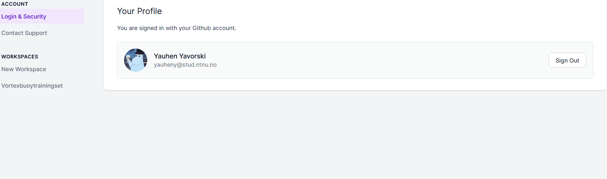

README.md

# YOLO detect buoys

  

## This is the README file for the project by Vortex that uses YOLO to detect buoys.

## Getting Started:

### :package: Prerequisites:

Make sure that you have the following installed on your system:

- [Python](https://www.python.org/)
- [pip](https://pip.pypa.io/en/stable/installation/)
- [venv](https://docs.python.org/3/library/venv.html)

### :runner: Run the application:

- Create a virtual environment by running `python -m venv venv`.
- Download the project dependencies by running `pip install -r requirements.txt`.
- Activate the virtual environment by running `source venv/bin/activate` (for Unix-based systems) or `venv\Scripts\activate` (for Windows).
- Make sure to create `.env` file and add `ROBOFLOW_API_KEY` variable equal to your token (you can obtain the token by following the instructions in the next section).
- To specify which dataset to read from Roboflow make to add the following environment variables to the `.env` file:
  - `ROBOFLOW_PROJECT_ID`: Id of the Roboflow project (_buoy-detection-qzjg1_)
  - `WORKSPACE`: if the grouping of the available datasets for our organization (_vortexbuoytrainingset_)
  - `ROBOFLOW_PROJECT_VERSION`: the number that indicates which version of the dataset pull be pulled (_1_)
  - `DATASET_FORMAT`: the format in which the dataset will be received (_yolov8_)
- Run the application by executing the `main.py` file.

---

## :robot: Roboflow

The data is stored in the [Roboflow](https://roboflow.com/) service. In order to get the data you have to first obtain the token which could give you permissions to access through Roboflow APIs. After obtaining the Roboflow token, you have get the necessary information which would allow Roboflow to find and fetch the required dataset. First make to get the Roboflow token as described in the following section.

### :key: Get Token:

The steps to get the token:

#### Go to settings:

Go to the upper right side of the Roboflow main page. Press on the your name to open the manu. Select the settings `Settings` option in the menu:

#### Settings:

Go to the side manu, and choose the name of the dataset, which in this case is `Vortexbouytrainingset` (markets as red in the image) and choose `Roboflow API`, as demonstrated by:

Then, in the appeared page, copy the string under the `Private API Key (for inference and REST API)`.

---

## :test_tube: Testing

The automated tests are stored in the `tests` directory. Make sure to [install `pytest`](https://docs.pytest.org/en/7.1.x/getting-started.html). The tests can be ran by using the command `pytest .`. The commands will run the test define the the `test_*.py` files. Make sure that you are in the `YOLO-detect-buoys` directory. The naming convention of testing files is comprised of the word `test_` followed by the name of the file to which the test is related: `test_<FILE_NAME>.py`. An example of that is `tests/test_utils.py` which is a python test file tah tests the functions `utils`.

---

## :rotating_light: Linting

Linting improves code quality by ensuring the the codebase does not contain bad-practices. Make sure to [install PyLint](https://pypi.org/project/pylint/) globally in order to use CLI. Use the command `pylint $(git ls-files '*.py')` in order to lint the files tracked by git. PyLint is used as the Python linter in this project. Make sure to install the [PyLint extension](https://pypi.org/project/pylint/) for VSCode or [PyLint plugin](https://plugins.jetbrains.com/plugin/11084-pylint) for JetBrains products like Pycharm. The rules are saved in the `.pylintrc` files.
