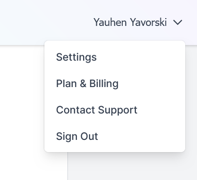
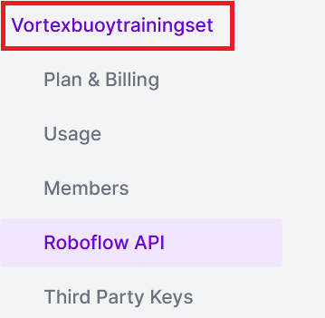

README.md

# YOLO detect buoys

This is the README file for the project by Vortex that uses YOLO to detect buoys.

## Usage:

- Download the project dependencies by running `pip install -r requirements.txt`.
- Create a virtual environment by running `python -m venv venv`.
- Activate the virtual environment by running `source venv/bin/activate` (for Unix-based systems) or `venv\Scripts\activate` (for Windows).
- Make sure to create `.env` file and add `ROBOFLOW_API_KEY` variable equal to your token
- Run the application by executing the `main.py` file.

## Get Token:

The steps to get the token:

### Go to settings:

Go to the upper right side of the Roboflow main page. Select the settings `Settings` option in the menu.

### Settings:

Go to the side manu, and choose the name of the dataset, which in this case is `Vortexbouytrainingset` (markets as red in the image) and choose `Roboflow API`, as demonstrated by:

Then, in the appeared page, copy the string under the `Private API Key (for inference and REST API)`.

## Entry Point:

- The `__main__.py` file is the entry point of the application.

## Testing
