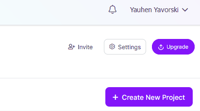

README.md

# YOLO detect buoys

## This is the README file for the project by Vortex that uses YOLO to detect buoys.

## Getting Started:

### Prerequisites:

Make sure that you have the following installed on your system:

- [Python](https://www.python.org/)
- [pip](https://pip.pypa.io/en/stable/installation/)
- [venv](https://docs.python.org/3/library/venv.html)

### Run the application:

- Create a virtual environment by running `python -m venv venv`.
- Download the project dependencies by running `pip install -r requirements.txt`.
- Activate the virtual environment by running `source venv/bin/activate` (for Unix-based systems) or `venv\Scripts\activate` (for Windows).
- Make sure to create `.env` file and add `ROBOFLOW_API_KEY` variable equal to your token
- Run the application by executing the `main.py` file.

---

## Get Token:

The steps to get the token:

### Go to settings:

Go to the upper right side of the Roboflow main page. Press on the your name to open the manu. Select the settings `Settings` option in the menu:

### Settings:

Go to the side manu, and choose the name of the dataset, which in this case is `Vortexbouytrainingset` (markets as red in the image) and choose `Roboflow API`, as demonstrated by:

Then, in the appeared page, copy the string under the `Private API Key (for inference and REST API)`.

---

## Testing

The automated tests are stored in the `tests` directory. Make sure to [install `pytest`](https://docs.pytest.org/en/7.1.x/getting-started.html). The tests can be ran by using the command `pytest .`. The commands will run the test define the the `test_*.py` files. Make sure that you are in the `YOLO-detect-buoys` directory. The naming convention of testing files is comprised of the word `test_` followed by the name of the file to which the test is related: `test_<FILE_NAME>.py`. An example of that is `tests/test_utils.py` which is a python test file tah tests the functions `utils`.

---

## Linting

Linting improves code quality by ensuring the the codebase does not contain bad-practices. Make sure to [install PyLint](https://pypi.org/project/pylint/) globally in order to use CLI. Use the command `pylint $(git ls-files '*.py')` in order to lint the files tracked by git. PyLint is used as the Python linter in this project. Make sure to install the [PyLint extension](https://pypi.org/project/pylint/) for VSCode or [PyLint plugin](https://plugins.jetbrains.com/plugin/11084-pylint) for JetBrains products like Pycharm. The rules are saved in the `.pylintrc` files.
